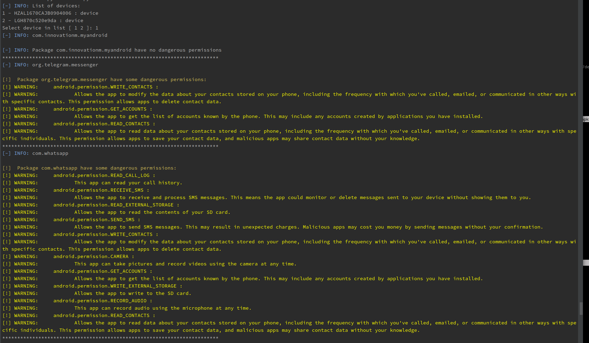
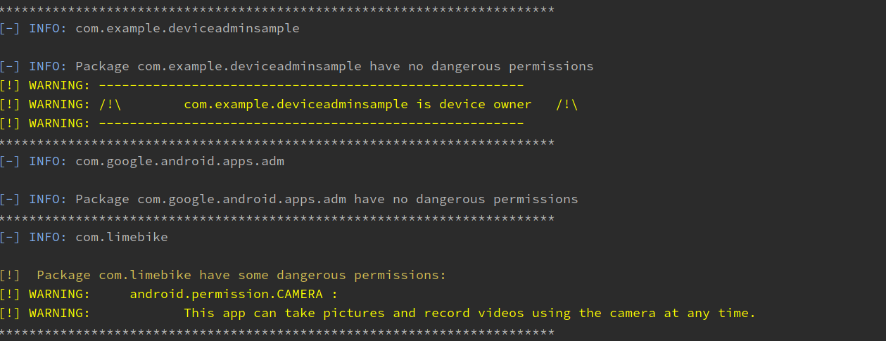
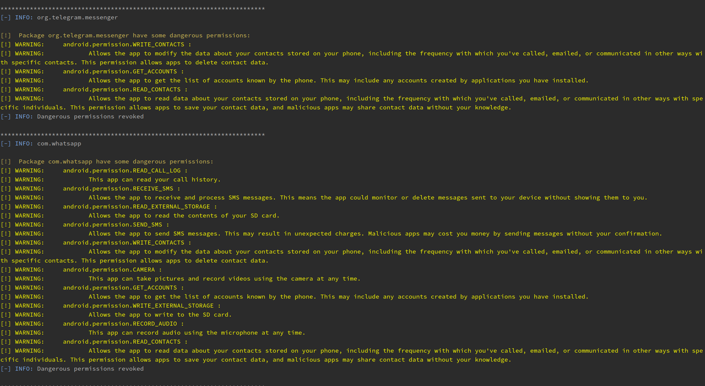
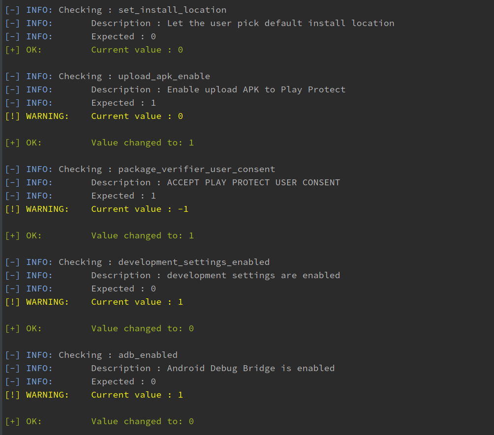
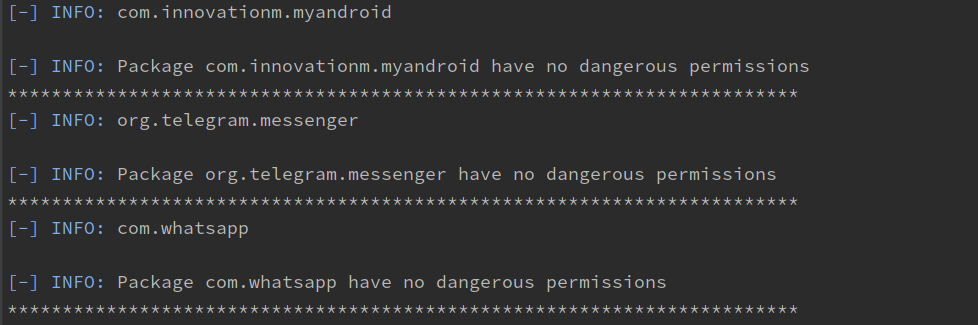
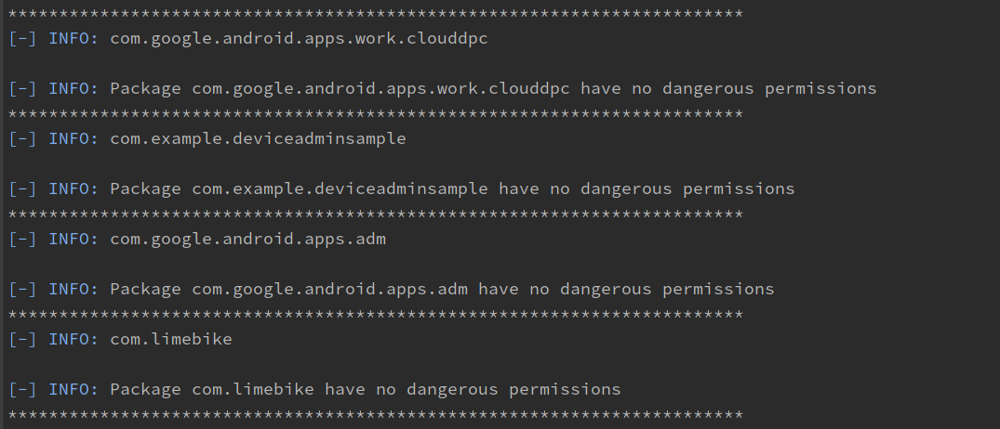

# AMDH
An Android Mobile Device Hardening written with python3 

## Motivations
AMDH was created to help automating and listing all applications installed devices and also to protect privacy in this "big" age of "data"

## Concept 
Android Mobile Device Hardening is divided on two parts (at this time):
- The first part list the installed applications on the device that use one or more [permissions flagged as dangerous by Android itself](https://developer.android.com/guide/topics/permissions/overview#dangerous_permissions) and dump all the APKs
- The second part is based on some CIS (Center of Internet Security) benchmark checks for Android devices and Android master's branch settings documentation ([Global settings](https://developer.android.com/reference/kotlin/android/provider/Settings.Global) and [Secure settings](https://developer.android.com/reference/kotlin/android/provider/Settings.Secure)) 

The first part:
- list application installed 
- list dangerous permissions 
- revoke admins receivers for third party Apps
- revoke dangerous permissions for all Apps
- dump APKs of all the Apps except system apps 

The second part:
- check the system settings (executed at every execution)
- harden the system settings

## Requirement
- Python3 
- Android Debug Bridge (ADB) installed

## Installation 
```
$ git clone https://github.com/SecTheTech/AMDH.git; cd AMDH
```

# Usage
```
$ python amdh.py -h
usage: amdh.py [-h] [-H] [-a ADB_PATH] [-t {e,d,3,s}] [-D APKS_DUMP_FOLDER] [-rar] [-R]

Android Mobile Device Hardening
By default the script will scan the Android system and Apps without any modification

optional arguments:
  -h, --help            show this help message and exit
  -H                    Harden system settings /!\ Developer Options and ADB will be disabled /!\ 
  -a ADB_PATH, --adb-path ADB_PATH
                        Path to ADB binary
  -t {e,d,3,s}          Type of applications:
                                e : enabled Apps
                                d : disabled Apps
                                3 : Third party Apps
                                s : System Apps
  -D APKS_DUMP_FOLDER, --dump-apks APKS_DUMP_FOLDER
                        Dump APKs from device to APKS_DUMP_FOLDER directory
  -rar                  Remove admin receivers: Remove all admin receivers if the app is not a system App
  -R                    For each app revoke all dangerous permissions
```

## Tests & CIS version
- Tested on Android 8, 9 and 10
- Devices: Nokia, LG, Honor, Xiaomi, OnePlus, AVD
- CIS version: 1.3.0 

## Screenshots:
**First scan**
```
$ python amdh.py -s
```





**Hardening settings and applications permissions**
```
$ python amdh.py -H -rar -R
```





> Note: ADB was disabled and "Developper Mode" hidden from the settings.

**Scan after Hardening**


The application com.example.deviceadminsample was device owner before the hardening:



## Roadmap
- Malware detection
- Applications settings hardening
- GUI

## Participate
Ideas and pull requests are welcome. 

Donation: [PayPal](https://www.paypal.com/cgi-bin/webscr?cmd=_s-xclick&hosted_button_id=NVWQM4EGVLKLU&source=url).

